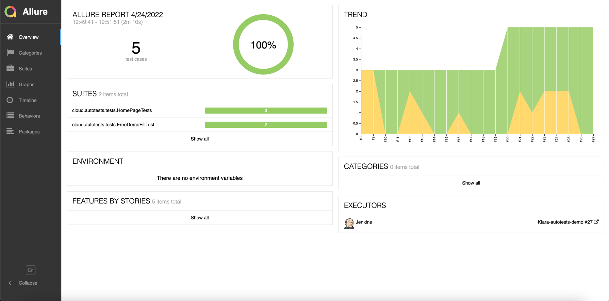
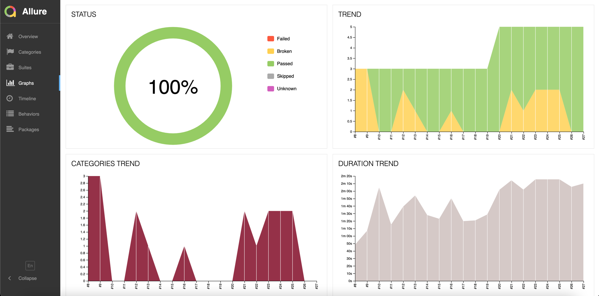

# Autotests demo project for <a target="_blank" href="https://www.klara.com/">Klara website</a>

## :mag: Содержание:

- [Технологии и инструменты](#earth_africa-технологии-и-инструменты)
- [Реализованные проверки](#earth_africa-Реализованные-проверки)
- [Сборка в Jenkins](#earth_africa-Jenkins-job)
- [Запуск из терминала](#earth_africa-Запуск-тестов-из-терминала)
- [Allure отчет](#earth_africa-Allure-отчет)
- [Отчет в Telegram](#earth_africa-Уведомление-в-Telegram-при-помощи-бота)
- [Видео примеры прохождения тестов](#earth_africa-Примеры-видео-о-прохождении-тестов)

##  Технологии и инструменты

<p align="center">
<a href="https://www.jetbrains.com/idea/"></a>
<a href="https://www.java.com/"></a>
<a href="https://github.com/"></a>
<a href="https://junit.org/junit5/"></a>
<a href="https://gradle.org/"></a>
<a href="https://selenide.org/"></a>
<a href="https://aerokube.com/selenoid/"></a>
<a href="https://github.com/allure-framework/allure2"></a>
<a href="https://www.jenkins.io/"></a>
</p>

## :white_check_mark: Реализованные проверки

- ✓ Взаимодействие с блоками контента на домашней странице
- ✓ Соответствие заголовка на домашней странице
- ✓ Проверка наличия ошибок в console log

## </a> Jenkins <a target="_blank" href="https://jenkins.autotests.cloud/job/Klara-autotests-demo/"> job </a>
<p align="center">
<a href="https://jenkins.autotests.cloud/job/Klara-autotests-demo/">
</a>
</p>

### Удаленный запуск тестов

```bash
gradle clean test 
-Dbrowser=${BROWSER}
-DbrowserVersion=${BROWSER_VERSION}
-DbrowserSize=${BROWSER_SIZE}
-DremoteDriverUrl=https://${USER}:${PASSWORD}@${REMOTE_DRIVER_URL}/wd/hub/
-DvideoStorage=https://${REMOTE_DRIVER_URL}/video/
-Dthreads=${THREADS}
```

### Параметры сборки в Jenkins:

> <code>BROWSER</code> – браузер, в котором будут выполняться тесты (_по умолчанию - <code>chrome</code>_).
>
> <code>BROWSER_VERSION</code> – версия браузера, в которой будут выполняться тесты (_по умолчанию - <code>91.0</code>_).
>
> <code>BROWSER_SIZE</code> – разрешени окна браузера, в котором будут выполняться тесты (_по умолчанию - <code>1920x1080</code>_).
>
> <code>REMOTE_URL</code> – адрес удаленного сервера, на котором будут запускаться тесты.
>
> <code>USER</code> - логин пользователя для подключения к Selenoid
>
> <code>PASSWORD</code> - пароль пользователя для подключения к Selenoid
>
> <code>THREADS</code> - количество одновременных запускаемых потоков для тестов.
>

### Запуск тестов из терминала

```bash
gradle clean test
```

## </a> Отчет в <a target="_blank" href="https://jenkins.autotests.cloud/job/Klara-autotests-demo/15/allure">Allure report</a>

### Основное окно

<p align="center">

</p>

### Тесты

<p align="center">

</p>

### Графики

<p align="center">

</p>


## </a> Уведомление в Telegram при помощи бота

<p align="center">

</p>


## </a> Видео прохождения теста

https://user-images.githubusercontent.com/24870446/164145218-aea61f76-56ff-490e-b63f-51e441417b5b.mp4
